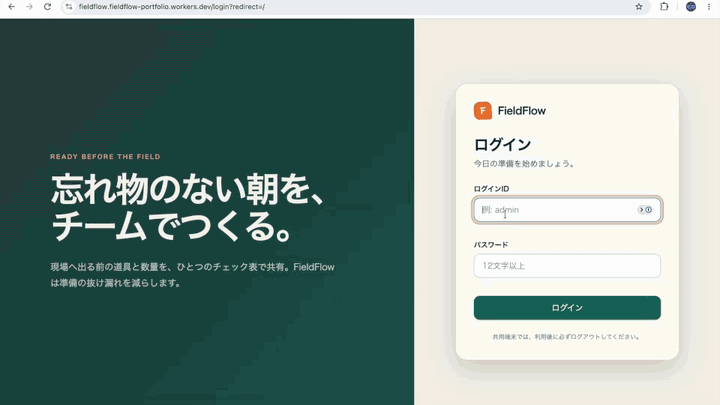
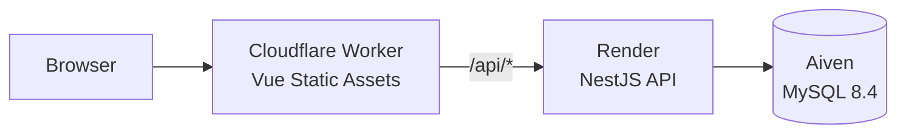

# FieldFlow

FieldFlowは、現場作業前の道具忘れと紙のチェック漏れを減らすための、チーム共有型の道具管理・日別チェックアプリです。

作業ごとに必要な道具と数量を選び、準備状況をスマートフォンから確認できます。管理者はユーザー・作業カテゴリ・道具を管理し、作業者はその日のチェック表をチームで共有します。

- 公開URL: [https://fieldflow.fieldflow-portfolio.workers.dev](https://fieldflow.fieldflow-portfolio.workers.dev)
- 対応画面幅: スマートフォン（320px）〜デスクトップ
- UI: 日本語

> Render FreeのAPIは、15分間アクセスがないと停止します。最初のアクセスでは再起動に約1分かかる場合があります。画面に起動待ちが表示された場合は、そのままお待ちください。

## デモ

[](https://github.com/Hiroyuki-12/FieldFlow/releases/download/v1.0.0/fieldflow-demo.mp4)

[▶ 高画質のデモ動画を再生する](https://github.com/Hiroyuki-12/FieldFlow/releases/download/v1.0.0/fieldflow-demo.mp4)

README上のGIFをクリックすると、高画質版の動画を再生できます。動画ファイルは[FieldFlow v1.0.0 Release](https://github.com/Hiroyuki-12/FieldFlow/releases/tag/v1.0.0)で公開しています。

動画では、ログイン、日別チェック表の作成、持ち出し数量の設定、準備チェックの自動保存、管理機能までの一連の操作を紹介します。

### デモアカウント

ポートフォリオ確認用の作業者アカウントを用意しています。ログインIDとパスワードはREADMEでは公開せず、提出フォームなどを通じて確認担当者へ個別に案内します。

- デモアカウントには、管理機能へアクセスできない作業者権限を設定しています。
- ユーザーやマスターデータを変更できる管理者アカウントの認証情報は案内しません。管理機能はデモ動画で確認できます。
- データベース、JWT、公開基盤などの秘密値は、READMEやGit履歴には保存しません。

## 制作した背景

以前の職場では、現場へ出発する前の道具準備に紙のチェックリストを使っており、道具の忘れ物や記入漏れが起きることがありました。特に、確認項目が多いときでも迷わず操作でき、準備状況を視覚的に把握できる仕組みが必要だと感じたことが、このアプリの出発点です。

最初に制作した旧版では、道具の一覧、数量変更、チェック操作を実装しました。FieldFlowではその経験と反省をもとに、画面を作り直すだけでなく、次の課題まで含めて再設計しました。

- 個人の端末内だけでなく、チームで同じチェック状況を共有する
- 作業内容に合わせ、その日に必要な道具だけを選択する
- 道具マスターを後から変更しても、過去のチェック記録を変えない
- 複数人の同時操作や通信失敗があっても、入力内容を安全に保存する
- 管理者と作業者の権限を分け、誤操作や不正操作を防ぐ
- 単体テストだけでなく、DB結合・画面操作・性能・ログまで確認する

「機能が動くこと」に加えて、なぜその設計にしたのか、障害時にどう調査するのか、変更後もどう品質を守るのかまで説明できるアプリを目指しています。

## 主な機能

### 日別チェック

- 日付と作業カテゴリから、その日に必要な道具のチェック表を作成
- 1日通し、または午前・午後に分けた作業へ対応
- 道具ごとに持ち出し数量と「準備済み」を入力
- 入力は道具単位で自動保存し、画面全体に保存状態を表示
- 数量未設定のカテゴリや未準備の道具を集計し、準備完了を判定
- 今日・未来日の設定変更と再作成、過去日の閲覧に対応

### マスター管理

- ユーザーの作成・編集・利用停止・仮パスワード再発行
- 作業カテゴリの作成・並び替え・利用停止・再有効化
- 道具の在庫数・作業カテゴリ・表示順・利用状態の管理
- 管理者と作業者のロールに応じた画面・APIのアクセス制御

### 認証

- JWT Access TokenとローテーションするRefresh Token
- Argon2idによるパスワードハッシュ化
- 初回ログイン時のパスワード変更
- ログイン失敗回数とIP単位のレート制限
- ログアウト、パスワード変更、利用停止時のセッション失効

## 見てほしいポイント

### 1. マスターと日別記録を分けたデータ設計

チェック表を作成した時点の道具名、カテゴリ名、在庫数をスナップショットとして保存します。後から道具マスターが変更・利用停止されても、過去や作成済みの記録が書き換わらない設計です。

設定変更や削除でも履歴を物理削除せず、取消済みの版として保持します。業務記録を残しながら、利用者は同じ日付のチェック表を安全に作り直せます。

### 2. 自動保存と同時更新への対策

数量やチェック状態は、道具ごとの独立したキューで順番に保存します。ある道具の保存が失敗しても、別の道具の操作まで止めません。

各データに版番号を持たせた楽観ロックで、別の利用者が先に更新した場合は`409 Conflict`を返します。画面は最新の状態へ戻し、上書きによる入力消失を防ぎます。

### 3. セキュリティを画面とAPIの両方で実施

Frontendの表示制御だけに頼らず、NestJSのGuardとServiceで認証・ロール・対象データの状態を検証します。Access Tokenはブラウザの永続領域へ保存せずメモリだけに保持し、Refresh TokenはHttpOnly CookieとDB上のハッシュで管理します。

### 4. 現場での利用を意識したUI

320px幅のスマートフォンからデスクトップまで利用できるレスポンシブUIです。色だけに依存せず状態を文字でも表示し、キーボード操作、フォーカス移動、エラー時の再操作にも配慮しています。

### 5. 異なる層を組み合わせた品質確認

FrontendとBackendの単体テスト、Testcontainers MySQLによる結合テスト、Playwrightによる主要操作のE2E、k6による性能試験を用意しています。JSONログとrequestIdにより、画面で起きたエラーをBackendの処理まで追跡できます。

## 技術構成

| 分類               | 技術                                                            |
| ------------------ | --------------------------------------------------------------- |
| Frontend           | Vue 3、TypeScript、Vite、Tailwind CSS、Pinia、Vue Router、Axios |
| Backend            | NestJS、TypeScript、TypeORM                                     |
| Database           | MySQL 8.4 LTS、TypeORM Migration                                |
| Authentication     | JWT、Refresh Token Rotation、Argon2id、HttpOnly Cookie          |
| Test               | Vitest、Jest、Testcontainers、Playwright、k6                    |
| CI                 | GitHub Actions                                                  |
| Public environment | Cloudflare Workers Static Assets、Render、Aiven MySQL           |

公開環境ではCloudflareを画面とAPIの単一オリジンにし、`/api/*`だけをRenderのNestJSへ転送します。Render APIの直接アクセスは共有鍵で拒否し、ブラウザへBackendのURLや共有鍵を公開しません。



構成の詳細は[Cloudflare・Render・Aiven公開構成](docs/design/cloudflare-architecture.md)を参照してください。

## 品質保証

| 対象        | 確認内容                                                                  |
| ----------- | ------------------------------------------------------------------------- |
| Frontend    | 型チェック、ESLint、単体・コンポーネントテスト、本番ビルド                |
| Backend     | 型チェック、ESLint、Service・Guard等の単体テスト、MySQL結合テスト、ビルド |
| E2E         | ログイン、管理、日別チェックの主要操作とレスポンシブ表示                  |
| Performance | 最大20 VU、主要APIのp95 500ms未満、想定外エラー率1%未満                   |
| CI          | Pull Requestと`main`更新時にFrontend・Backend・Cloudflare・E2Eを実行      |

通常の開発DB、E2E DB、性能試験DBを分離し、テストデータが開発中のデータへ混ざらないようにしています。k6は既定でlocalhost以外へ負荷を送れず、誤って公開環境へ負荷をかけない設計です。

## 現在の状態と今後の改善

MVPのアプリケーション機能、セキュリティ、ログ、E2E、性能試験、Cloudflare公開基盤に加え、AWS検証環境のTerraformと承認付きCDまで実装済みです。AWS実環境へのapply・deployと主要操作の検証も完了し、検証環境は継続課金を止めるためdestroy済みです。

### 業務機能として実現したいこと

今後は、現場で発生する予定共有、道具準備、作業後の報告をFieldFlow内でつなげることを目指しています。

#### 週間・月間スケジュール

週間・月間単位で作業予定を登録し、予定された作業カテゴリを当日の日別チェックへ反映します。事前に作業内容を登録しておくことで、毎朝同じ情報を入力する負担を減らし、予定された作業と道具準備の不一致を防ぎます。

#### 作業報告書

日別チェックで入力した作業日、作業内容、使用した道具などを利用して、作業報告書を作成できるようにします。準備時に入力した情報を報告書へ再利用し、同じ内容の二重入力を減らすことを想定しています。

#### お知らせ・連絡確認

当日の作業変更、天候による中止・休業、注意事項などをチームへ共有できるお知らせ欄を追加します。利用者はスタンプで確認済みを伝え、必要に応じてコメントを残せます。管理者は誰が確認したかを把握でき、口頭連絡の行き違いを減らせます。

### 技術・運用面で検討していること

- 誰が確認・変更したかを残す操作履歴とチェック表の最終確定
- 複数チーム・複数組織への対応
- パスワード再設定やMFAなどのアカウント管理
- 写真、保管場所、貸出・返却などの道具情報
- AWS検証環境を再構築するときのAWS仕様・利用料金の再確認

## ディレクトリ構成

```text
FieldFlow/
├── frontend/    # Vueの画面、Router、Pinia、API Client、Vitest
├── backend/     # NestJS API、TypeORM Entity・Migration、Jest・Testcontainers
├── cloudflare/  # Workers Static AssetsとRender API proxy
├── e2e/         # Playwrightの主要操作・レスポンシブE2E
├── perf/        # k6シナリオと性能試験専用データ準備
├── infra/       # AWS検証環境のTerraform、remote state bootstrap、運用手順
├── docs/        # 現行仕様、設計、運用手順、実装履歴
├── mock/        # 初期の画面遷移確認用モック
├── compose.yaml # ローカルMySQL 8.4
└── render.yaml  # Render Web Service設定
```

## ローカルでの実行

### 必要な環境

- Node.js 24.18.0 LTS
- npm 11
- Docker Desktop（Docker Composeを含む）

Node.jsのバージョンは`.nvmrc`と`.node-version`で固定しています。

### 初回セットアップ

```bash
cp .env.example .env
cp backend/.env.example backend/.env
cp frontend/.env.example frontend/.env

cd backend
npm ci

cd ../frontend
npm ci

cd ../cloudflare
npm ci
```

`.env`はローカル専用で、Gitの追跡対象には含めません。公開環境のパスワードや秘密値を`.env.example`へ記載しないでください。

### 起動

リポジトリ直下でMySQLを起動します。

```bash
docker compose up -d db
docker compose ps
```

初回だけMigrationとSeedを実行します。

```bash
cd backend
npm run migration:run
npm run seed:run
```

別々のターミナルでBackendとFrontendを起動します。

```bash
cd backend
npm run start:dev
```

```bash
cd frontend
npm run dev
```

| Service                    | URL・port                        |
| -------------------------- | -------------------------------- |
| Frontend                   | http://localhost:5173            |
| Backend health API         | http://localhost:8080/api/health |
| Swagger UI（開発環境のみ） | http://localhost:8080/api/docs   |
| MySQL                      | localhost:3306                   |

### 品質チェック

```bash
cd frontend
npm run typecheck
npm run lint
npm test -- --run
npm run build

cd ../backend
npm run typecheck
npm run lint
npm test
npm run test:integration
npm run build

cd ../e2e
npm run typecheck
npm test

cd ../perf
npm run typecheck
k6 inspect scenarios/smoke.ts
k6 inspect scenarios/checklist.ts
k6 inspect scenarios/master.ts

cd ../cloudflare
npm run typecheck
npm test
npm run check:deploy
```

E2Eと性能試験のデータ準備・起動方法は、[設計資料一覧](docs/README.md)と[性能試験README](perf/README.md)を参照してください。

## ドキュメント

- [要件定義](docs/requirements.md)
- [設計資料一覧](docs/README.md)
- [アプリケーション構成・技術スタック](docs/design/application-architecture.md)
- [API設計](docs/design/api.md)
- [DB設計](docs/design/database.md)
- [セキュリティ設計](docs/design/security.md)
- [ログ・監視・バックアップ設計](docs/design/operations.md)
- [テスト方針](docs/design/test-strategy.md)
- [要件・設計・テストのトレーサビリティ](docs/design/traceability.md)

## フィードバック

FieldFlowは、実際の業務課題を題材に、要件定義から設計、実装、テスト、公開・運用までを一貫して考えるために制作したポートフォリオです。コード、設計、使いやすさについてのフィードバックを歓迎します。
