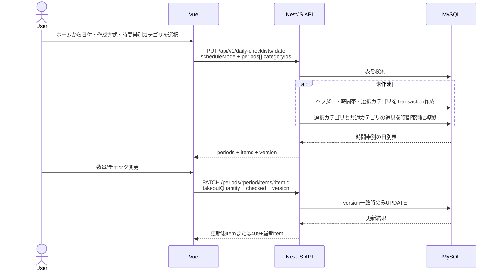

# アプリケーション構成・技術スタック

## 1. 採用技術

| 層 | 技術 | 基準 |
| --- | --- | --- |
| Runtime | Node.js | 24 LTS |
| Frontend | Vue / TypeScript / Vite | Vue 3.5 / TS 6 / Vite 8 |
| UI | Tailwind CSS | 4.3 |
| Routing / State | Vue Router / Pinia | 安定版をlockfile固定 |
| HTTP | Axios | Access Token付与とRefresh一重化 |
| Frontend test | Vitest / Vue Testing Library / MSW | 単体・画面統合 |
| Backend | NestJS / TypeScript | NestJS 11 / TS 6 |
| DB access | TypeORM / mysql2 | TypeORM 1.1、Data Mapper |
| Validation / API | class-validator / Swagger(OpenAPI) | DTOを単一のAPI契約にする |
| Password | Argon2id | `argon2` |
| Backend test | Jest / Supertest / Testcontainers | 単体・MySQL結合 |
| E2E / Performance | Playwright / k6 | Chromium / API負荷 |
| DB | MySQL | 8.4 LTS、ローカル・Cloudflare/Aiven・AWS/RDSで同一メジャー |

依存は`package-lock.json`で固定し、`npm ci`で再現する。実装開始時に相互互換性を確認した正確なpatch版を記録する。

## 2. フロントエンド構成

```text
frontend/src/
├── api/          # Axios、API型、機能別クライアント
├── components/   # 再利用UI
├── features/     # auth/users/categories/tools/checklists
├── router/       # 認証・ロール・初回変更ガード
├── stores/       # Pinia（認証と最小限の共有状態）
├── views/        # 画面単位
└── styles/       # Tailwindテーマと共通スタイル
```

- サーバーデータを不必要にPiniaへ複製せず、画面単位でAPIから取得する。
- Access Tokenはauth storeのメモリにだけ保持する。
- Axios interceptorは401時のRefreshを同時に1回だけ実行し、1回再試行して失敗ならログインへ戻す。
- API DTOと画面フォーム型を区別し、日別項目の`version`を更新成功ごとに置換する。

## 3. バックエンド構成

```text
backend/src/
├── auth/ users/ categories/ tools/ daily-checklists/
│   ├── *.controller.ts   # HTTP、DTO、認可宣言
│   ├── *.service.ts      # 業務ルール、トランザクション
│   ├── dto/              # 入出力検証
│   └── entities/         # TypeORM Entity
├── common/               # Guard、Filter、Interceptor、エラー
├── config/               # 型付き環境変数
├── database/migrations/  # TypeORM Migration
├── health/               # /api/health
└── main.ts
```

- ControllerはHTTP変換、Serviceは業務判断、Repository/Entityは永続化に責任を分ける。
- グローバルValidationPipe、例外Filter、requestId・アクセスログInterceptorを設定する。
- TypeORMの`DataSource.transaction`で日別表生成、状態変更、セッションローテーションを原子的に処理する。
- Swaggerは開発環境でAPI確認に使い、どちらの公開環境でも公開範囲を制限する。

## 4. 主なデータフロー



## 5. 環境変数

- Frontend: `VITE_API_BASE_URL`。Cloudflare・AWSの両公開環境は同一オリジンの`/api/v1`、ローカルはVite proxyを推奨する。
- Backend共通: `NODE_ENV`、`PORT=8080`、DB接続、JWT署名鍵、Token期限、Cookie Secure、許可Origin、`LOG_LEVEL`、`TRUST_PROXY_HOPS`。
- Cloudflare固有: Aiven MySQLへのTLS有効化、CA、接続pool上限。秘密値はCloudflare SecretsからContainerへ注入する。
- AWS固有: RDS接続情報とOrigin検証値。秘密値はSSM SecureStringからECSへ注入する。
- 起動時に型・必須値・範囲を検証し、不正なら安全に起動失敗させる。

## 6. 参照資料

- [Node.js Releases](https://nodejs.org/en/about/previous-releases)
- [Vue Core](https://github.com/vuejs/core)
- [NestJS Releases](https://github.com/nestjs/nest/releases)
- [NestJS TypeORM Integration](https://docs.nestjs.com/techniques/database)
- [TypeORM](https://www.npmjs.com/package/typeorm)
- [MySQL 8.4 LTS](https://dev.mysql.com/doc/refman/8.4/en/mysql-releases.html)
- [Tailwind CSS](https://tailwindcss.com/blog)
- [デプロイ環境の使い分け](deployment-strategy.md)
