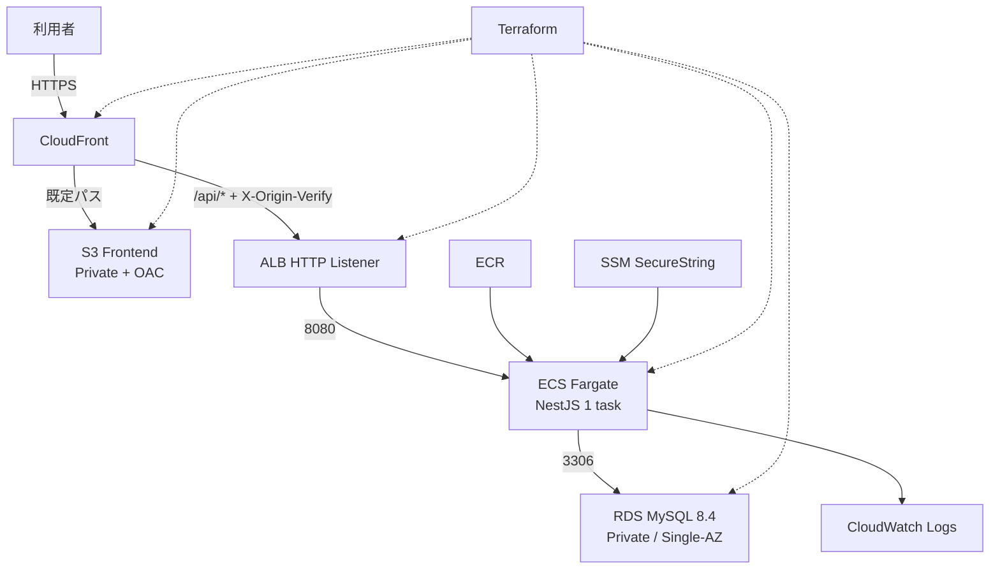

# AWS・Terraform構成

## 1. 方針

RaiseTimeLineと同じ、EC2を管理しない低コストの学習用構成を採用する。フロントとAPIを1つのCloudFront URLへ集約し、ローカル・CI・本番で同じコンテナとMySQLメジャーバージョンを使う。

## 2. 全体構成



## 3. サービス別設計

| サービス | 設計 |
| --- | --- |
| CloudFront | 単一入口。HTTPSへリダイレクトし、`/api/*`だけALBへ転送。APIキャッシュ無効 |
| S3 frontend | Vueの`dist/`を保存。Public Access Block有効、OAC経由だけ読取 |
| ALB | Public Subnet 2AZ。既定403、秘密ヘッダー一致時だけFargateへ転送 |
| ECS Fargate | Public Subnet、公開IPあり、0.25 vCPU / 0.5GB、desired count 1、port 8080 |
| ECR | backendイメージをcommit SHAタグで保存。`latest`をデプロイ識別に使わない |
| RDS | MySQL 8.4、Private Subnet、Single-AZ、20GB gp3、暗号化、port 3306 |
| SSM | DBパスワード、JWT鍵、Origin検証値をSecureString保存 |
| CloudWatch | ECS標準出力のJSONログ、保持30日、アラーム通知先は導入時に設定 |
| IAM | Execution RoleとTask Roleを分離し、必要最小限の権限を付与 |

画像機能はMVP対象外のため、RaiseTimeLineの画像用S3・`/media/*`ビヘイビア・画像IAM権限は移植しない。

## 4. ネットワーク

- Region: `ap-northeast-1`、VPC: `10.0.0.0/16`。
- Public Subnetを`1a`と`1c`に各1つ配置し、ALBとFargateを置く。
- Private Subnetを2AZに各1つ配置し、RDS Subnet Groupにする。
- NAT Gatewayは費用削減のため置かず、FargateはPublic SubnetからECR・SSM・Logsへ出る。

| Security Group | Ingress |
| --- | --- |
| ALB SG | internetから80。ヘッダー不一致はListenerで403 |
| Fargate SG | ALB SGから8080だけ |
| RDS SG | Fargate SGから3306だけ |

CloudFront→ALBがHTTPである点は独自ドメインなしの学習用制約として明記する。可用性・機密性要件が上がる場合は、独自ドメインとACMを導入してALBもHTTPS化し、FargateをPrivate Subnet＋VPC Endpointへ移す。

## 5. CloudFront

- 既定ビヘイビアはS3、`/api/*`はALB。
- SPAルートのS3 404だけを`/index.html`の200へ置換する。APIの401/403/404は置換しない。
- APIは全HTTPメソッドを許可し、Query、Authorization、Cookieを必要な範囲で転送する。
- 独自ドメイン未取得のMVPではCloudFront既定証明書を使う。

## 6. RDS・バックアップ

- `db.t3.micro`相当の学習用クラス、Single-AZ、削除保護なしを初期値とする。
- 自動バックアップを7日保持し、ストレージ暗号化と自動マイナーバージョン更新を有効にする。
- `terraform destroy`前は必要に応じて手動スナップショットを作る。学習環境の既定は最終スナップショットなしだが、実運用では逆にする。
- Migrationは新イメージを使う一回限りECSタスクで先に実行し、成功後にServiceを更新する。

## 7. Terraform構成

```text
infra/
├── versions.tf / providers.tf
├── variables.tf / locals.tf / outputs.tf
├── network.tf / security_groups.tf
├── s3_frontend.tf / cloudfront.tf
├── ecr.tf / iam.tf / ssm.tf
├── alb.tf / ecs.tf / rds.tf
└── terraform.tfvars.example
```

- stateは暗号化・バージョニング済みS3、ロックはDynamoDBを使用する。
- `*.tfvars`、state、planファイル、秘密値をGit管理しない。
- 共通タグに`Project=fieldflow`、`Environment=prod`、`ManagedBy=terraform`を付与する。
- `terraform fmt -check`、`validate`、`plan`をPRで確認し、`apply`・`destroy`はユーザー承認後だけ実行する。

## 8. 復旧・拡張

- ECS障害はServiceがタスクを再作成する。RDS障害はバックアップから手動復旧する。
- 規模拡大時はECS desired count 2以上、Auto Scaling、RDS Multi-AZ、NAT/VPC Endpoint、WAFを段階的に追加する。
- RTO/RPOの保証が必要になった時点で、Single-AZと手動復旧方針を再設計する。

## 9. 参照資料

- [Amazon RDS for MySQL versions](https://docs.aws.amazon.com/AmazonRDS/latest/UserGuide/MySQL.Concepts.VersionMgmt.html)
- RaiseTimeLineの`docs/aws-architecture.md`と`infra/`（FieldFlow外のローカル参照元）
