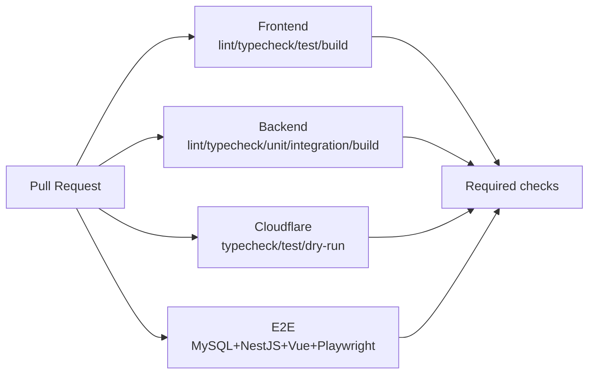
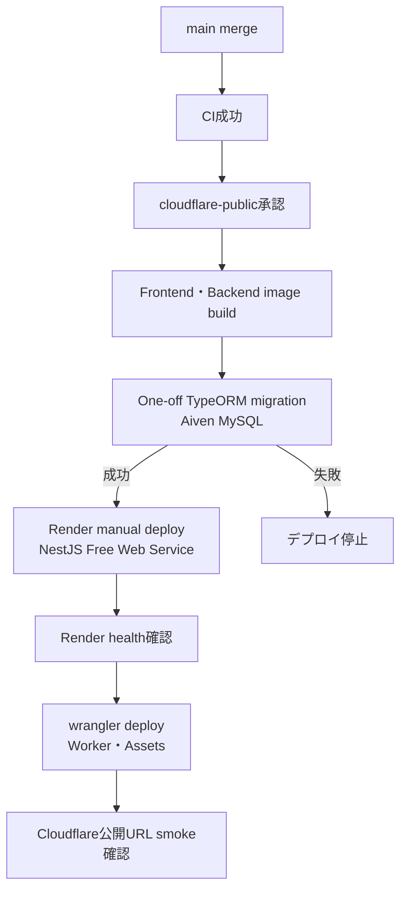
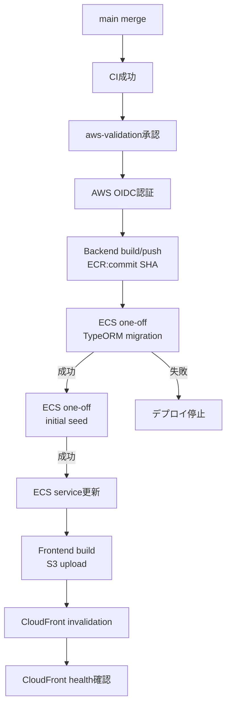

# CI/CD設計

## 1. ブランチ・PR

- `main`へ直接commit・pushしない。
- 1 Issue = 1 branch = 1 PRとし、ブランチ名は`<type>/#<issue>-<slug>`。
- PR本文に`Closes #<issue>`を含め、レビュー会話とCIを全て解決してからsquashまたはrebase mergeする。
- 公開先ごとにGitHub Environment `cloudflare-public`と`aws-validation`を分け、各Environmentの承認後だけデプロイする。

## 2. CI

現行の`.github/workflows/ci.yml`は上記4 jobを実行する。Terraform jobは`infra/`を追加するロードマップ17で導入し、`fmt -check`と`validate`に成功した場合だけRequired checkへ加える。

### Frontend job

1. `.node-version`で固定したNode.js 24、`npm ci`
2. `npm run lint`
3. `npm run typecheck`
4. `npm test -- --run`
5. `npm run build`
6. `frontend/dist`をArtifactとして7日間保存

### Backend job

1. `.node-version`で固定したNode.js 24、`npm ci`
2. `npm run lint`
3. `npm run typecheck`
4. `npm run test`
5. `npm run test:integration`
6. `npm run build`
7. `backend/dist`をArtifactとして7日間保存

現行CIでは、Service・Guard等の単体テストに加え、Testcontainers MySQL 8.4を用いてController、Service、TypeORM、Migration、DB制約を通す結合テストを同じjobで実行する。

### Cloudflare job

1. Frontendをbuildし、Workers Static Assets用の`frontend/dist`を作る
2. Workerの型チェックとAPI／Assets routing単体テストを実行する
3. `wrangler deploy --dry-run`でWorker bundleとAssets設定を検証する
4. Cloudflare API Tokenや本番Secretsを使わず、外部環境を変更しない

### CIの再現性と安全性

- Frontend・Backendを独立したjobとして並列実行し、失敗箇所を判別しやすくする。
- `npm ci`で各`package-lock.json`どおりにインストールし、npmのダウンロードキャッシュで実行時間を短縮する。`node_modules`自体はArtifactとして共有しない。
- Workflowの`permissions`は`contents: read`だけに制限する。
- GitHub公式Actionも完全なcommit SHAで固定し、参照先が意図せず変更されるリスクを抑える。
- 同じブランチの古い実行は`concurrency`でキャンセルし、最新commitの結果を優先する。
- build成果物はデバッグと後続処理の確認用に7日間だけ保存し、秘密値を含めない。

### E2E job

MySQL 8.4を3306で起動し、通常環境と分離した`fieldflow_e2e` DBへMigrationとE2E Seedを適用する。NestJSを8080、Playwrightの`webServer`でVueを5173に起動し、Chromium 1 workerで認証・管理・日別チェックを実行する。失敗時だけreport・trace・screenshot・video・Backend logをArtifactとして7日保持し、成功時は認証Cookieや不要な実行証跡を保存しない。

### Performance workflow

k6性能試験は通常PRのRequired checkへ含めず、リリース候補、性能に関わる変更、利用者の指定時に`workflow_dispatch`から実行する。使い捨てMySQL 8.4の`fieldflow_perf`へMigrationと専用Seedを適用し、buildしたNestJSを8080へ起動する。`smoke`、`checklist`、`master`、`all`を選択でき、p95・想定外エラー率のthreshold違反をWorkflow失敗として扱う。summary JSONは7日間、失敗時Backendログは7日間Artifactへ保存し、架空認証情報以外を使用しない。

## 3. CD

Cloudflare公開環境は承認後に手動でMigration、Render deploy、Wrangler deployを行う。AWS実務構成検証環境には`.github/workflows/aws-deploy.yml`を実装し、`main`の手動実行、`DEPLOY`確認入力、GitHub Environment承認の三条件が揃った場合だけ更新する。

### 3.1 Cloudflare公開環境

- 初回公開は手順を理解しながら手動実行してよいが、実行コマンド、設定値の置き場所、確認結果を記録し、再現できる状態にする。
- 自動化時は対象Account・Workerに限定したCloudflare API Tokenを`cloudflare-public` Environmentへ保存する。Global API Keyは使用しない。
- Aiven Migration用の接続情報とTLS CAはEnvironment Secretsで保護し、WorkflowログやArtifactへ出さない。
- Migration成功後だけRenderを更新し、Render health成功後にWorkerとStatic AssetsをCloudflareへ反映する。
- 公開URLでhealth、ログイン、Refresh、日別表の最小スモーク確認を行う。公開環境へk6負荷試験は実行しない。

### 3.2 AWS実務構成検証環境

- AWS固定アクセスキーをGitHub Secretsへ置かず、OIDCと最小権限IAM Roleを使用する。
- Backendイメージはcommit SHAタグで指定し、どのコードが動いているか追跡可能にする。
- Migration失敗時はECS Serviceを更新しない。アプリ失敗時は直前のイメージタグへ戻せるようTask Definition revisionを保持する。
- Seedは通常Serviceと別Task Definitionへ初期passwordを注入して実行し、通常稼働Taskへ初期passwordを渡さない。既存管理者を更新しない冪等処理のため再deployでもpasswordを巻き戻さない。
- Frontendはビルド後にS3へ同期し、CloudFront invalidationを行う。削除対象を含む同期は差分を確認する。

## 4. Terraform

- `infra/`とCIのTerraform jobを実装済みである。CIはremote backendやAWS credentialを使わず、`init -backend=false`、`fmt -check -recursive`、`validate`を実行する。
- PRで`terraform fmt -check`と`terraform validate`を行う。
- `plan`はAWS認証が利用できる安全なイベントで生成し、秘密値をartifactへ含めない。
- `apply`と`destroy`は自動実行せず、差分・影響・復旧方法を説明してユーザー承認後に行う。
- CloudflareのWorker・AssetsはWrangler、Render serviceは`render.yaml`で管理し、AWS Terraformへ混ぜない。

## 5. 保護設定

- mainのRequired checksにFrontend、Backend、Cloudflare、E2Eを登録する。
- force push、branch deletion、未レビューmergeを禁止する。
- Dependabot等の更新も通常PRとして全テストを通す。
