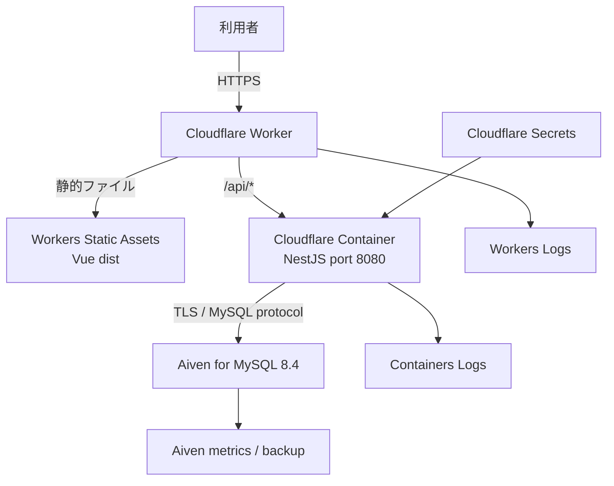

# Cloudflare・Aiven公開構成

## 1. 方針

コンテスト審査と転職用ポートフォリオでは、低アクセスの期間も公開URLを維持できるよう、Cloudflareを画面とAPIの単一入口にする。BackendはCloudflare Containersで必要時に起動し、永続データはAiven for MySQL 8.4へ保存する。

Cloudflare Containersのローカルディスクは一時領域であり、停止・再作成・デプロイ後の永続性を保証しない。そのためMySQLをBackend Container内で動かさず、Containerのライフサイクルから独立したAivenへ分離する。

## 2. 全体構成

VueとAPIを同じ`workers.dev`または独自ドメイン配下で公開し、Frontendの`VITE_API_BASE_URL=/api/v1`を維持する。Refresh Cookieを別サイトへ送らずに済むため、`HttpOnly; Secure; SameSite=Lax`の現在の認証設計を変更しない。

## 3. サービス別設計

| サービス | 責務 |
| --- | --- |
| Worker | HTTPSの単一入口。`/api/*`をBackend Containerへ渡し、それ以外を静的Assetsへ渡す |
| Workers Static Assets | `frontend/dist`のHTML、CSS、JavaScriptを配信し、Vue Router用のSPA fallbackを行う |
| Cloudflare Containers | Node.js 24のNestJS、Argon2id、TypeORM、`mysql2`を既存構成のまま実行する |
| Cloudflare Secrets | DBパスワード、JWT鍵、DB TLS関連値などを暗号化して保持し、Container起動時に注入する |
| Aiven for MySQL | MySQL 8.4の永続データ、バックアップ、メトリクスをContainerと独立して管理する |
| Wrangler | Worker、Assets、Container、非秘密設定を宣言し、ローカル確認とデプロイを行う |

Cloudflare D1はSQLite系であり、MySQL用Entity、Migration、制約の互換性を保証できないため採用しない。RenderのマネージドDBはPostgreSQLが中心で、MySQLを使う場合はPersistent Disk上の自己管理が必要になるため、今回の永続DBには採用しない。

## 4. Container設計

- BackendはマルチステージDockerfileでbuildし、runtime imageへ本番依存と`dist`だけを含める。
- Node.js 24を使用し、Cloudflareの実行要件に合わせた`linux/amd64`イメージとして検証する。
- 非rootユーザーでport `8080`を待ち受ける。
- health確認は`GET /api/health`を使用し、秘密情報やDB接続詳細を返さない。
- ポートフォリオの低アクセスを前提に、アイドル後はContainerをスリープさせる。
- 予期しない並列起動と費用増加、Aivenの接続上限超過を防ぐため、初期は最大Instance数を1に制限する。
- スリープ後の初回リクエストではコールドスタートが発生し得るため、READMEへ数秒待って再試行する可能性を記載する。

Containerのスリープ時間、Instance type、上限は実装時の実測メモリ、Argon2id応答時間、料金表を確認して決める。設計書の値を検証せず固定しない。

## 5. Aiven MySQL接続

- MySQL 8.4を選び、ローカル・Testcontainers・RDSと同じメジャーバージョンを維持する。
- Aivenが発行するhost、port、database、user、passwordを環境変数としてContainerへ渡す。
- Containerの外向き通信はAivenのhostを許可対象へ限定し、MySQLのTCP接続とDNS解決が本番で成功することを確認する。
- 公開ネットワークを通るためTLS証明書を検証し、暗号化だけで証明書検証を無効にする設定は採用しない。
- TypeORMの接続設定へ本番用TLS有効化とCA読込を追加し、ローカル開発では従来どおりTLSなしを選べるようにする。
- 接続poolの上限をAivenプランの`max_connections`より十分小さくし、最大Container数との積で上限を超えないようにする。
- 無料枠はSLA対象外で、継続利用がない場合に休止される可能性がある。通知を確認し、長期公開の可用性が不足する場合は有料プランまたは別DBへ移行する。

## 6. 秘密値と環境変数

Gitで管理するWrangler設定には、サービス名、port、Assets path、スリープ方針などの非秘密値だけを記載する。

Cloudflare Secretsで管理する主な値:

- `DB_PASSWORD`
- `JWT_ACCESS_SECRET`
- AivenのTLS CAを渡すための値
- 初期Seedを実行するときだけ必要な初期管理者パスワード

DBの接続情報やJWT鍵をDocker imageの`ARG`・`ENV`、Wranglerの平文`vars`、GitHub Actionsログ、READMEへ含めない。初期管理者パスワードはSeed後に通常Containerへ残さない。

## 7. Migration・Seed・デプロイ

初回公開では次の順序を守る。

1. Aiven for MySQL 8.4を作成し、TLS接続を確認する。
2. Cloudflare用のBackend imageをローカルでbuild・起動確認する。
3. 承認された一回限りの実行環境から`migration:show`と`migration:run`をAivenへ実行する。
4. `seed:run`で初期管理者と`共通`カテゴリを作成する。
5. Cloudflare Secretsを登録する。
6. Worker、Assets、Containerをデプロイする。
7. 公開URLでhealth、ログイン、Refresh、管理画面、日別表更新をスモーク確認する。

MigrationをContainerの通常起動コマンドへ連結しない。Containerがコールドスタートや再配置で複数回起動しても、DDLを繰り返さないためである。自動CDを追加するときも、Migration成功をBackend更新の前提条件にする。

## 8. セキュリティ

- 利用者からWorkerまではHTTPSを強制する。
- APIは同一オリジンの`/api/*`だけから利用し、資格情報付きCORSへワイルドカードを使用しない。
- `CORS_ORIGIN`は実際の`workers.dev`または独自ドメインに固定する。
- `COOKIE_SECURE=true`を使用する。
- WorkerからContainerへ送るProxyヘッダーを実測し、`TRUST_PROXY_HOPS`を実際の段数だけに設定する。
- Workerで転送する`X-Forwarded-For`等を利用者入力のまま信頼しない。
- Aiven接続はTLS証明書を検証する。
- 公開デモ用管理者をREADMEへ載せる場合は、第三者によるデータ変更を想定し、長期公開前にデモ保護または復旧手順を実装する。

## 9. ログ・監視・費用

- WorkerとContainerのログを有効にし、requestIdでNestJSのJSONログを追跡する。
- Aivenの接続数、ストレージ、バックアップ、休止通知を確認する。
- 外形監視は公開health APIを低頻度で確認し、コールドスタートを無効化する目的の過剰な常時pingは行わない。
- 最大Instance数、スリープ時間、CPU上限を設定し、課金画面と利用量を定期確認する。
- 料金プランと無料枠は実装時に公式情報を再確認し、想定を超えた場合の停止条件を決める。

### 2026年8月時点の費用前提

| 項目 | 前提 | 注意点 |
| --- | --- | --- |
| Cloudflare Workers / Containers | ContainersはWorkers Paidプランが必要で、基本料金は月額5 USD。Container使用量の一部が含まれる | 5 USDは上限ではない。Instance、CPU、ディスク、ログ、Durable Objects、超過通信量により追加課金があり得る |
| Aiven for MySQL | 無料枠はクレジットカード不要・期間制限なし。1 node、1 CPU、1 GB RAM、1 GB disk、最大76接続、監視・バックアップ付き | SLA・サポート対象外。継続的な利用がないサービスは通知後に停止されることがあり、手動再開が必要 |

したがって「完全無料で常時起動」ではなく、「Cloudflareの月額5 USD程度を基本に、BackendはScale to Zero、DBはAiven無料枠で開始する低予算構成」と説明する。コンテスト審査期間はAivenの通知と稼働状態を毎日確認し、レビューに必要な期間の可用性を優先する。

## 10. 対象外

- Cloudflare D1へのDB移行
- 複数Container Instanceへの水平分散
- 独自ドメインの必須化
- SLA、無停止デプロイ、Multi-Region DBの保証
- 公開環境へのk6負荷試験

## 11. 参照資料

- [Cloudflare Workers Static Assets](https://developers.cloudflare.com/workers/static-assets/)
- [Cloudflare Containers](https://developers.cloudflare.com/containers/)
- [Cloudflare Containers pricing](https://developers.cloudflare.com/containers/pricing/)
- [Cloudflare Containers lifecycle](https://developers.cloudflare.com/containers/platform-details/architecture/)
- [Cloudflare Containers secrets](https://developers.cloudflare.com/containers/examples/env-vars-and-secrets/)
- [Cloudflare Containers outbound traffic](https://developers.cloudflare.com/containers/platform-details/outbound-traffic/)
- [Aiven for MySQL free tier](https://aiven.io/docs/products/mysql/concepts/mysql-free-tier)
- [Aiven for MySQL version lifecycle](https://aiven.io/docs/products/mysql/reference/version-lifecycle)
- [Aiven for MySQL version management](https://aiven.io/docs/products/mysql/howto/manage-mysql-version)
