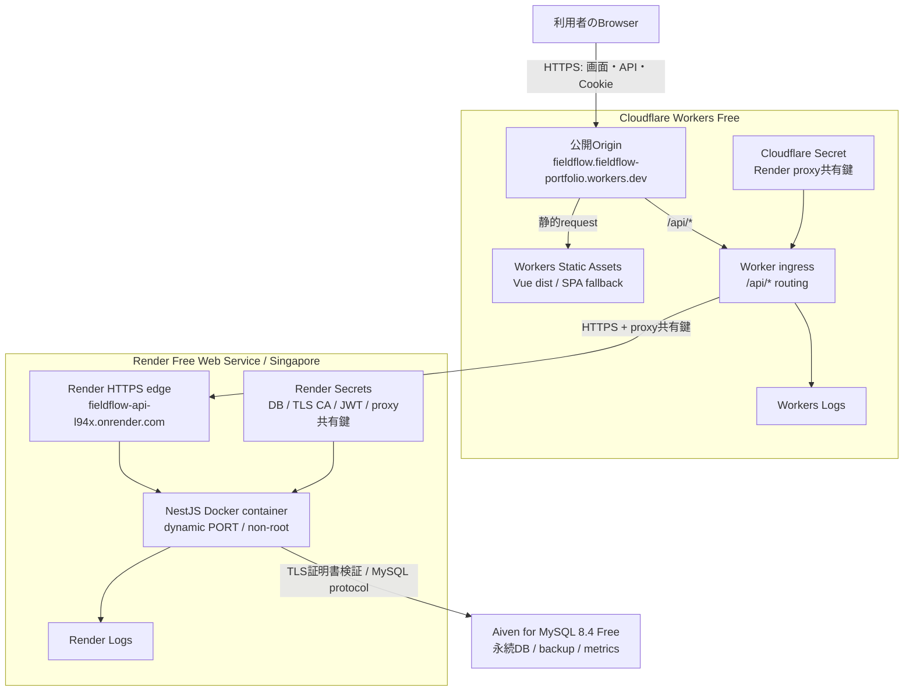
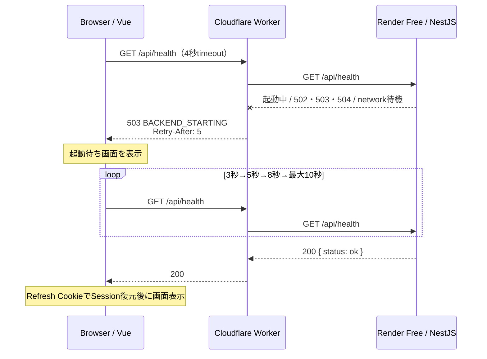

# Cloudflare・Render・Aiven公開構成

## 1. 方針

ポートフォリオの長期公開では、Cloudflare Workers Static Assetsと無料枠Workerを画面・APIの単一公開Originにする。VueはCloudflare edgeから配信し、Workerは`/api/*`だけをRender Free Web ServiceのNestJSへproxyする。永続データは作成済みのAiven for MySQL 8.4へTLS接続して保存する。

Cloudflare Containersは使用しない。Workers Paidの月額契約を避けながら既存のDocker化したNestJSを動かすため、Backend computeをRender Freeへ分離する。Renderのローカルファイルは停止・再作成・デプロイで失われるため、MySQLはRender内へ置かない。

## 2. インフラ構成図

Vueの`VITE_API_BASE_URL=/api/v1`を維持し、画面とAPIを同じCloudflare Origin配下で公開する。Login／Refresh responseの`Set-Cookie`はWorkerが変更せずBrowserへ返す。Domain属性を付けないRefresh CookieはCloudflare公開Originへ保存され、`Path=/api/v1/auth; HttpOnly; Secure; SameSite=Lax`の既存設計を維持できる。

## 3. request flow

### 通常時

1. BrowserがCloudflareの公開URLへアクセスする。
2. HTML、CSS、JavaScriptはWorkers Static Assetsが返す。
3. Browserは同じOriginの`/api/*`を呼ぶ。
4. WorkerはRender URLへpath、query、method、bodyを保って転送する。
5. NestJSはAiven MySQLへ証明書検証付きTLSで接続する。
6. WorkerはRender responseとRefresh CookieをBrowserへ透過する。

### Renderコールドスタート時

Render Freeは15分間inbound trafficがないと停止し、次のrequestで再起動する。起動は約1分かかる場合がある。Frontendはhealthを4秒で区切り、3秒、5秒、8秒、以後最大10秒間隔で再確認する。外形監視や常時pingで意図的に起動状態を維持せず、無料枠の設計を尊重する。

## 4. サービス別責務

| サービス                 | 責務                                                                                 |
| ------------------------ | ------------------------------------------------------------------------------------ |
| Cloudflare Worker        | HTTPSの単一入口。`/api/*`をRenderへproxyし、Proxy Headerと共有鍵を安全な値へ置換する |
| Workers Static Assets    | `frontend/dist`のHTML、CSS、JavaScript配信とVue Router用SPA fallback                 |
| Render Free Web Service  | Node.js 24、NestJS、Argon2id、TypeORM、`mysql2`をDockerで実行する                    |
| Aiven for MySQL          | MySQL 8.4の永続データ、backup、metricsをBackendのライフサイクルから分離して管理する  |
| Wrangler / `render.yaml` | 非秘密設定、routing、build、health、Free plan、regionをコードで再現する              |

Cloudflare D1はSQLite系でMySQL用Entity・Migration・制約の互換性がないため採用しない。Render PostgresもDB種別が異なるため、確定技術のMySQL 8.4をAivenで維持する。

## 5. Render Backend設計

- `backend/Dockerfile`のmulti-stage build、Node.js 24、非root実行を再利用する。
- Renderが注入する`PORT`を受け入れ、`0.0.0.0`でlistenする。
- Render regionは日本から近いSingaporeとする。regionは作成後に変更できない。
- `GET /api/health`でAPIとDBの疎通を確認する。
- `render.yaml`は`plan: free`と`autoDeployTrigger: off`を明示し、承認なしの外部更新を防ぐ。
- Free serviceはsingle instance、ephemeral filesystemで運用し、永続データを置かない。
- DB poolは5接続に制限し、Aiven Freeの接続上限を使い切らない。

## 6. 同一Originと入口保護

- BrowserはRender URLをAPI base URLとして使用しない。
- Workerは利用者入力の`Forwarded`、`X-Forwarded-*`、`X-FieldFlow-Proxy-Secret`を削除してから再構成する。
- WorkerとNestJSへ同じ32byte以上のproxy共有鍵をSecret登録する。
- NestJSは共有鍵がない業務APIを`403`で拒否する。Renderのplatform health checkに必要な`/api/health`だけは共有鍵なしで許可する。
- `CORS_ORIGIN`はCloudflare公開Originへ固定し、資格情報付きCORSにwildcardを使わない。
- WorkerがRenderの502、503、504または接続例外を、内部情報のない`503 BACKEND_STARTING`へ統一する。

## 7. Aiven MySQL接続

- 作成済みのAiven MySQL 8.4 Free serviceを使用する。
- host、port、database、user、password、CAはRender環境変数へ登録し、Gitへ含めない。
- 公開networkを通るためTLS証明書を検証し、`rejectUnauthorized=false`は使用しない。
- CAのPEMはBase64化して`DB_TLS_CA_BASE64`へ登録し、起動時に復元する。
- TypeORM `synchronize`は禁止し、review済みMigrationを一回限りの承認付き処理で適用する。

## 8. 秘密値

Cloudflare Secret:

- `RENDER_PROXY_SECRET`

Render Secret / dashboard入力:

- `CORS_ORIGIN`
- `INGRESS_PROXY_SECRET`（Cloudflareと同じ値）
- `DB_HOST`、`DB_PORT`、`DB_NAME`、`DB_USER`、`DB_PASSWORD`
- `DB_TLS_CA_BASE64`
- `JWT_ACCESS_SECRET`（Blueprintで生成）

初期管理者passwordはMigration／Seed時だけ使用し、Render通常runtimeへ登録しない。秘密値はチャット、Git、command引数、shell history、build logへ含めない。

## 9. Migration・Seed・デプロイ順序

1. Aiven MySQL 8.4の`Running`とTLS接続を確認する。
2. Local／CIでFrontend、Backend image、Workerを検証する。
3. 承認された一回限りの環境からAivenへMigrationと初期Seedを適用する。
4. 承認後にRender Free Web Serviceを作成し、Render Secretsを登録する。
5. Renderをdeployし、Render URLのhealthを確認する。
6. Cloudflareへproxy共有鍵をSecret登録する。
7. WorkerとStatic Assetsをdeployする。
8. Cloudflare公開URLでコールドスタート、Login、Refresh、管理、日別表更新を確認する。

MigrationをRenderの通常起動やpre-deployへ自動連結しない。コールドスタート、再起動、deployのたびにDDLを繰り返さず、失敗時にBackend更新を止められるようにする。

## 10. 費用・無料枠・監視

2026年8月時点の開始前提:

| 対象                    | 費用前提                                        | 主な制限                                                                                                                 |
| ----------------------- | ----------------------------------------------- | ------------------------------------------------------------------------------------------------------------------------ |
| Workers Static Assets   | 0 USD。静的asset requestとstorageに追加料金なし | Freeは1 versionあたり20,000 files、1 file 25 MiB                                                                         |
| Workers Free            | 0 USD                                           | 100,000 requests/day、CPU 10 ms/invocation。`/api/*`だけWorkerを実行する                                                 |
| Render Free Web Service | 0 USD                                           | workspace合計750 instance hours/month、15分idleで停止、再起動約1分、ephemeral filesystem、outbound/build/bandwidth枠あり |
| Aiven MySQL Free        | 0 USD                                           | 1 node、1 CPU、1 GB RAM、1 GB disk、最大76接続、SLAなし、未使用時に停止される可能性あり                                  |

Worker request上限超過時は`/api/*`が429または制限errorになり得る。Renderは月間枠や外向き通信量の条件で停止される可能性がある。Cloudflare usage、Render usage／events、Aiven接続数／storage／通知を確認し、無料枠を超える前に公開継続またはpaid移行を判断する。

## 11. 対象外

- Cloudflare Containers、Durable Objects、Workers Paid
- Cloudflare D1へのDB移行
- Render paid instance、複数instance、persistent disk
- 独自domainの必須化
- SLA、無停止deploy、multi-region DBの保証
- 公開環境へのk6負荷試験

## 12. 参照資料

- [Cloudflare Workers Static Assets](https://developers.cloudflare.com/workers/static-assets/)
- [Static Assets billing and limitations](https://developers.cloudflare.com/workers/static-assets/billing-and-limitations/)
- [Cloudflare Workers limits](https://developers.cloudflare.com/workers/platform/limits/)
- [Render Free services](https://render.com/docs/free)
- [Render Blueprint YAML reference](https://render.com/docs/blueprint-spec)
- [Render Web Services](https://render.com/docs/web-services)
- [Render regions](https://render.com/docs/regions)
- [Render health checks](https://render.com/docs/health-checks)
- [Aiven for MySQL free tier](https://aiven.io/docs/products/mysql/concepts/mysql-free-tier)
- [Aiven for MySQL version lifecycle](https://aiven.io/docs/products/mysql/reference/version-lifecycle)
