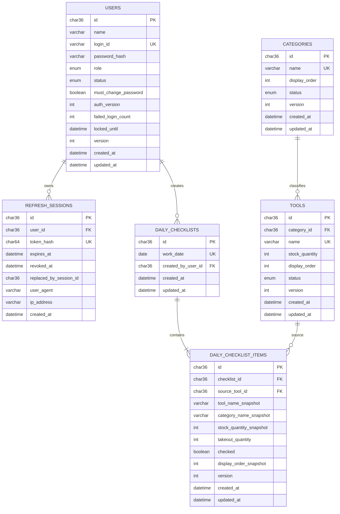

# DB設計・ER図

## 1. 共通方針

- MySQL 8.4 LTS、InnoDB、`utf8mb4`、照合順序`utf8mb4_0900_ai_ci`を使用する。
- 主キーはUUID文字列（`char(36)`）。日時はUTCの`datetime(6)`、業務日は`date`で保存する。
- `synchronize`は全環境で無効とし、TypeORM Migrationだけでスキーマを変更する。
- マスターとユーザーは物理削除せず、`status`で利用可否を管理する。

## 2. ER図

## 3. テーブル定義

### users

| カラム | 型・制約 | 説明 |
| --- | --- | --- |
| id | `char(36)` PK | UUID |
| name | `varchar(100)` not null | 表示名 |
| login_id | `varchar(50)` unique not null | 正規化したログインID |
| password_hash | `varchar(255)` not null | Argon2idハッシュ |
| role | `enum('ADMIN','WORKER')` | 権限 |
| status | `enum('ACTIVE','INACTIVE')` | 利用状態 |
| must_change_password | `boolean` default true | 初回変更制御 |
| auth_version | `int unsigned` default 1 | 全端末のAccess Token失効判定 |
| failed_login_count | `int unsigned` default 0 | ログイン制限用 |
| locked_until | `datetime(6)` null | 一時制限終了時刻 |
| version | `int unsigned` default 1 | 楽観ロック |
| created_at / updated_at | `datetime(6)` | 監査日時 |

### refresh_sessions

`user_id`はusersへ外部キー、`token_hash`はSHA-256等による固定長ハッシュを一意保存する。`revoked_at`がnullかつ`expires_at`が未来の場合だけ有効。端末識別情報は調査用であり、認証判断には使わない。

主なインデックス: `(user_id, revoked_at, expires_at)`、`token_hash unique`。

### categories / tools

- カテゴリ・道具の名称はDB照合順序でも大文字小文字を区別せず一意にする。
- toolsの`category_id`はcategoriesへ`ON DELETE RESTRICT`で参照する。
- 主なインデックスはcategoriesの`(status, display_order)`、toolsの`(status, category_id, display_order)`。

### daily_checklists

- `work_date unique`により1日1件を保証する。
- `created_by_user_id`は作成者の管理情報であり、誰が各チェックを変更したかを示す業務履歴ではない。
- ユーザー利用停止後も参照を残すため`ON DELETE RESTRICT`とする。

### daily_checklist_items

- `(checklist_id, source_tool_id)`を一意とし、同一道具の重複追加を防ぐ。
- 数量は`check (takeout_quantity between 0 and stock_quantity_snapshot)`を付ける。
- `checked=true`かつ数量0を禁止するCHECK制約を付け、Service層でも同じ検証を行う。
- 更新SQLは`where id = ? and version = ?`とし、成功時`version = version + 1`。更新件数0なら競合として最新行を取得する。

## 4. トランザクション

- 日別表初回生成は、ヘッダー作成と有効道具の一括複製を1トランザクションで行う。
- 同時生成で一意制約に負けた処理はロールバックし、既存表を取得して正常応答する。
- 数量0への変更とチェック解除は1回のUPDATEで行う。
- カテゴリ停止判定、最後の管理者判定はトランザクション内で対象をロックしてから更新する。

## 5. Migration運用

1. Entity変更と同じPRでMigrationを作成する。
2. ローカルMySQL 8.4とTestcontainersで上りMigrationを検証する。
3. 本番デプロイでは新コンテナの一回限りECSタスクで`migration:run`を実行する。
4. Migration成功後だけECS Serviceを更新する。
5. 原則として後方互換な追加→アプリ移行→不要列削除を別リリースに分け、破壊的な自動rollbackへ依存しない。
