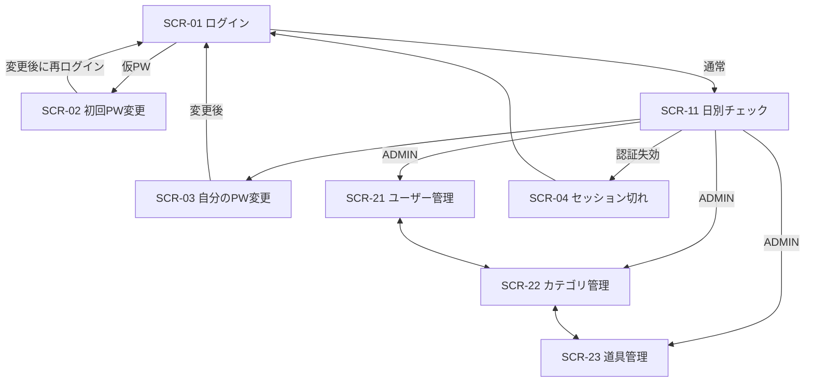

# 画面設計

## 1. 共通方針

- 日本語、モバイルファーストで360px以上に対応する。PCでは一覧幅を広げ、機能は変えない。
- 入力には常に視覚的な`label`を付け、色だけで状態を伝えない。フォーカス表示、キーボード操作、44px程度のタップ領域を確保する。
- API処理中は対象操作だけを無効化し、成功・失敗を画面上の通知領域で伝える。`alert()`は使わない。
- 管理者だけに管理ナビゲーションを表示する。ただし権限の最終判断はAPIで行う。

## 2. 画面一覧

| ID | 画面 | 利用者 | 主な目的 |
| --- | --- | --- | --- |
| SCR-01 | ログイン | 未認証 | ログインID・パスワード認証 |
| SCR-02 | 初回パスワード変更 | 初回ログイン者 | 仮パスワードの変更 |
| SCR-03 | 自分のパスワード変更 | 全ユーザー | 通常のパスワード変更 |
| SCR-04 | セッション切れ表示 | 全ユーザー | 再ログイン案内 |
| SCR-11 | 日別チェック | 全ユーザー | 日付選択、数量・チェックの共有更新 |
| SCR-21 | ユーザー管理 | 管理者 | ユーザーCRUD相当、仮パスワード表示 |
| SCR-22 | カテゴリ管理 | 管理者 | カテゴリ作成・編集・利用停止 |
| SCR-23 | 道具管理 | 管理者 | 道具作成・編集・利用停止 |
| SCR-90 | 403 | ログイン済み | 権限不足の説明 |
| SCR-91 | 404 | 全ユーザー | 存在しない画面の案内 |

## 3. 画面遷移



## 4. SCR-11 日別チェック

### スマートフォン

```text
┌──────────────────────────┐
│ FieldFlow       [メニュー]│
├──────────────────────────┤
│ 日付  [ 2026-07-21  📅 ] │
│ [今日]  過去日は閲覧のみ  │
├──────────────────────────┤
│ 電動工具                  │
│ インパクトドライバー      │
│ 在庫 3                    │
│ 持出 [−]  2  [＋]         │
│ [✓ 準備済み]  保存済み    │
├──────────────────────────┤
│ 清掃用具                  │
│ ほうき / 在庫 5           │
│ 持出 [−]  0  [＋]         │
│ [  準備済み]（無効）      │
└──────────────────────────┘
```

### PC

```text
┌──────────────────────────────────────────────────────────┐
│ FieldFlow  日別チェック  道具  カテゴリ  ユーザー  アカウント│
├──────────────────────────────────────────────────────────┤
│ 日付 [2026-07-21] [今日]                   [道具を追加]*   │
├────────────┬────────────────┬──────┬────────┬──────────┤
│ カテゴリ   │ 道具           │ 在庫 │ 持出数 │ 準備状態 │
├────────────┼────────────────┼──────┼────────┼──────────┤
│ 電動工具   │ インパクト...  │ 3    │ − 2 ＋ │ ☑ 保存済 │
└────────────┴────────────────┴──────┴────────┴──────────┘
* 管理者のみ
```

### 項目と動作

| 項目 | 動作 |
| --- | --- |
| 日付 | 初期値は今日。過去日は`GET`、今日・未来日は`PUT`で取得・作成 |
| 数量 | ±ボタンと数値入力。範囲外は送信せずインラインエラー |
| チェック | 数量0では無効。変更ごとに行単位で自動保存 |
| 保存状態 | `保存中`、`保存済み`、`保存失敗`をテキストとアイコンで表示 |
| 競合 | `409`の最新行へ置換し「他のユーザーが更新しました」を表示 |
| 道具追加 | 管理者のみ。未追加の有効道具を選ぶダイアログ |
| 表なし | 過去日は「この日のチェック表はありません」。今日・未来日は空表も作成可能 |

## 5. 管理画面

### 一覧共通

- 上部に検索・状態フィルター、作成ボタンを置く。
- モバイルはカード、PCはテーブルで表示する。
- 作成・編集はダイアログまたは同一画面のフォームとし、保存前に入力検証する。
- 利用停止は確認ダイアログを表示し、「削除」ではなく「利用停止」と表記する。
- APIの`409`は対象ルールを説明する日本語メッセージへ変換する。

### 仮パスワード表示

```text
┌──────────────────────────────┐
│ ユーザーを作成しました       │
│ 仮パスワード                  │
│  X7...16文字...qP   [コピー]  │
│                              │
│ この画面を閉じると再表示でき │
│ ません。安全な方法で本人へ   │
│ 伝えてください。             │
│                    [閉じる]  │
└──────────────────────────────┘
```

## 6. 認証画面の状態

- ログイン送信中は二重送信を防止する。
- 認証失敗は項目を特定せず共通エラーを表示する。
- 初回変更画面は新パスワード・確認入力を持ち、成功後にAccess Tokenを破棄して再ログインへ遷移する。
- Refresh失敗時は同時に失敗した複数APIからRefreshを重複実行せず、1回の失敗でSCR-04へ遷移する。

## 7. レスポンシブ・アクセシビリティ確認

- 360px、768px、1280pxで横スクロールなく主要操作ができる。
- 入力エラーは対象項目と関連付け、スクリーンリーダーへ通知する。
- ダイアログはフォーカストラップ、Escで閉じる、閉じた後に起点へフォーカスを戻す。
- チェック状態、利用状態、保存状態は文字情報を併記する。
