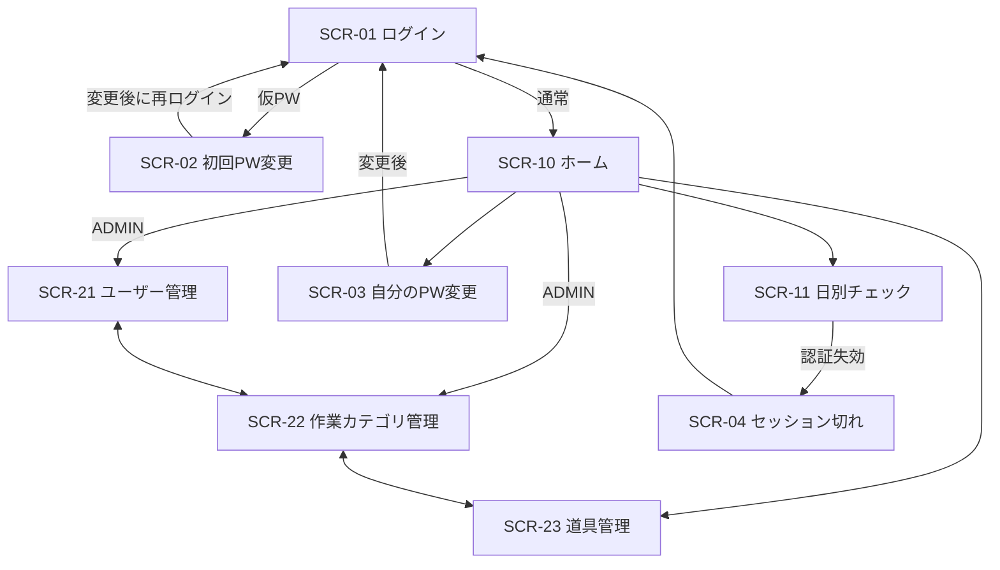

# 画面設計

## 1. 共通方針

- 日本語、モバイルファーストで320px以上に対応する。PCでは一覧幅を広げ、機能は変えない。
- 入力には常に視覚的な`label`を付け、色だけで状態を伝えない。フォーカス表示、キーボード操作、44px程度のタップ領域を確保する。
- API処理中は対象操作だけを無効化し、成功・失敗を画面上の通知領域で伝える。`alert()`は使わない。
- 全ログインユーザーへホーム、日別チェック、道具管理を表示し、管理者だけに作業カテゴリ管理・ユーザー管理を追加する。ただし権限の最終判断はAPIで行う。
- `xl`以上では主要ナビゲーションをヘッダーへ横並びにし、パスワード変更・ログアウトはユーザー情報から開くアカウントメニューへ分ける。`xl`未満ではユーザー情報を含めてハンバーガーメニューへ集約する。

## 2. 画面一覧

| ID | 画面 | 利用者 | 主な目的 |
| --- | --- | --- | --- |
| SCR-01 | ログイン | 未認証 | ログインID・パスワード認証 |
| SCR-02 | 初回パスワード変更 | 初回ログイン者 | 仮パスワードの変更 |
| SCR-03 | 自分のパスワード変更 | 全ユーザー | 通常のパスワード変更 |
| SCR-04 | セッション切れ表示 | 全ユーザー | 再ログイン案内 |
| SCR-10 | ホーム | 全ユーザー | 今日・別日・管理機能への起点 |
| SCR-11 | 日別チェック | 全ユーザー | 作業カテゴリ選択、時間帯切り替え、数量・チェック更新 |
| SCR-21 | ユーザー管理 | 管理者 | ユーザーCRUD相当、仮パスワード表示 |
| SCR-22 | 作業カテゴリ管理 | 管理者 | 作業カテゴリ作成・編集・利用停止 |
| SCR-23 | 道具管理 | 全ユーザー | 一覧閲覧。管理者は作成・編集・利用停止 |
| SCR-90 | 403 | ログイン済み | 権限不足の説明 |
| SCR-91 | 404 | 全ユーザー | 存在しない画面の案内 |

## 3. 画面遷移



## 4. SCR-10 ホーム

- ログイン成功直後に表示し、管理画面へ直接遷移させない。
- 今日のチェックがなければ`今日のチェックを作成`、あれば進捗と`今日のチェックを開く`を表示する。
- 作成時は同じダイアログ内で`1日通し`または`午前・午後`を選ぶ。
- `1日通し`では作業カテゴリを1組、`午前・午後`では午前用・午後用を別々に選ぶ。タブ切り替え時も入力内容を保持し、まとめて作成する。
- 別日の確認では日付を選択して日別チェックへ移動する。
- 管理者には道具・作業カテゴリ・ユーザー管理へのショートカット、作業者には「作業を選ぶ → 数量を入力 → 準備済みにする」の利用手順を表示する。

## 5. SCR-11 日別チェック

### スマートフォン

```text
┌──────────────────────────┐
│ FieldFlow       [メニュー]│
├──────────────────────────┤
│ 日別チェック  7/21 午前   │
│ 日付と時間帯     [変更する] │
│ [ 午前 ] [ 午後 ]          │
│ 準備 2/3  [━━━━━━ 67%]    │
│ 草取り  共通（自動）       │
│ 自動保存: すべて保存済み   │
├──────────────────────────┤
│ 草取り              3種類 │
│ 道具・在庫  持出数  準備   │
│ 草刈機 在2 [−]2[＋] ☑済   │
│ 鎌     在4 [−]1[＋] ☐未   │
├──────────────────────────┤
│ 共通                3種類 │
│ 手袋   在10[−]0[＋] 対象外 │
└──────────────────────────┘
```

### PC

```text
┌──────────────────────────────────────────────────────────┐
│ FieldFlow  ホーム  日別チェック  道具管理  作業カテゴリ管理  │
│ ユーザー管理                                      [利用者] │
├──────────────────────────────────────────────────────────┤
│ 日付 [2026-07-21] [今日]       [作業カテゴリを追加]       │
│ [午前] [午後]  準備 2/3 ━━━━━ 67%  自動保存: 保存済み    │
├──────────────────┬──────────────┬──────────────────────┤
│ 道具・在庫       │ 持ち出し数   │ 準備状態             │
├──────────────────┼──────────────┼──────────────────────┤
│ 草刈機 / 在庫2   │ − 2 ＋       │ ☑ 準備済み           │
└──────────────────┴──────────────┴──────────────────────┘
```

### 項目と動作

| 項目 | 動作 |
| --- | --- |
| 日付 | 初期値は今日。過去日は`GET`、今日・未来日は`PUT`で取得・作成 |
| 作成方式 | 初回作成時に`1日通し`または`午前・午後`を選択。今日・未来日は`時間帯・作業内容を変更する`から修正可 |
| 時間帯 | 1日通し、または午前・午後を切り替える。午前・午後は独立した入力状態を保持 |
| 作業カテゴリ | 各時間帯で1件以上選択。選択カテゴリの道具と`共通`道具を表示 |
| 数量 | ±ボタンと数値入力。範囲外は送信せずインラインエラー |
| チェック | 数量0では無効。変更ごとに行単位で自動保存 |
| 保存状態 | 通常完了は画面全体に`すべて保存済み`を1件だけ表示。行には`保存中`、`保存失敗`、競合など、その道具で対応が必要な状態だけを表示 |
| 進捗 | 数量1以上の道具だけを分母にし、未設定時は`持ち出し未設定`と表示 |
| 競合 | `409`の最新行へ置換し「他のユーザーが更新しました」を表示 |
| カテゴリ追加 | 全ユーザー。今日・未来日の時間帯へ未選択の有効な作業カテゴリを追加 |
| 設定変更 | 全ユーザー。現在の方式・カテゴリを初期表示し、同じ時間帯・同じ道具の入力を引き継いで新版を保存 |
| 表の削除 | 全ユーザー。通常操作から分けた`その他の操作`を開き、`この日のチェック表を削除する`から確認後に削除して同日の再作成画面へ戻す。内部では取消履歴を保持 |
| 表なし | 過去日は「この日のチェック表はありません」。今日・未来日は作成方式と時間帯別の作業カテゴリを選んで作成 |
| モバイル補助設定 | 日付・時間帯設定を`aria-expanded`付きで折りたたみ、道具一覧の表示領域を優先 |

作成・設定変更・追加ダイアログは本文だけをスクロールし、見出しと操作ボタンを表示領域に残す。入力済み内容がある設定変更では、引継ぎ対象と失われる可能性のある内容を説明して再確認する。日別チェックへ遷移したときは画面先頭から表示する。

## 6. 管理画面

### 一覧共通

- 上部に検索・状態フィルター、作成ボタンを置く。
- モバイルはカード、PCはテーブルで表示する。
- 作成・編集はダイアログまたは同一画面のフォームとし、保存前に入力検証する。
- 利用停止は確認ダイアログを表示し、「削除」ではなく「利用停止」と表記する。
- APIの`409`は対象ルールを説明する日本語メッセージへ変換する。
- 作業カテゴリはカードで表示し、編集・利用停止をカード右上へ配置する。`共通`には利用停止を表示しない。
- ユーザー・道具の作成／編集と各確認ダイアログは、固定ヘッダー、スクロール可能な本文、固定操作フッターの3領域に分ける。低い画面やモバイルキーボード表示時も入力と操作ボタンを重ねず、長いエラーや仮パスワードを横スクロールなしで折り返す。

### 仮パスワード表示

```text
┌──────────────────────────────┐
│ ユーザーを作成しました       │
│ 仮パスワード                  │
│  X7...16文字...qP   [コピー]  │
│                              │
│ この画面を閉じると再表示でき │
│ ません。安全な方法で本人へ   │
│ 伝えてください。             │
│                    [閉じる]  │
└──────────────────────────────┘
```

## 7. 認証画面の状態

- ログイン送信中は二重送信を防止する。
- 形式・必須項目の入力エラーは項目ごとに関連付け、最初に修正すべき入力欄へフォーカスする。
- 認証失敗は項目を特定せず共通エラーを表示する。
- 初回変更画面は新パスワード・確認入力を持ち、成功後にAccess Tokenを破棄して再ログインへ遷移する。
- Refresh失敗時は同時に失敗した複数APIからRefreshを重複実行せず、1回の失敗でSCR-04へ遷移する。

## 8. レスポンシブ・アクセシビリティ確認

- 320px、390px、768px、1024px、1280px以上の代表幅で横スクロールなく主要操作ができる。
- 入力エラーは対象項目と関連付け、スクリーンリーダーへ通知する。
- ダイアログはフォーカストラップ、Escで閉じる、閉じた後に起点へフォーカスを戻す。
- 画面遷移後はスクロール位置を先頭へ戻し、新しい画面の主見出しへフォーカスを移す。
- 現在のナビゲーション項目は背景色だけでなく`aria-current="page"`でも示す。
- チェック状態、利用状態、保存状態は文字情報を併記する。
- 道具行は360px以上で1行を基本とし、320〜359pxでは2行以内に収める。約200%の文字拡大でも保存失敗の再試行と削除確認を操作できる。
